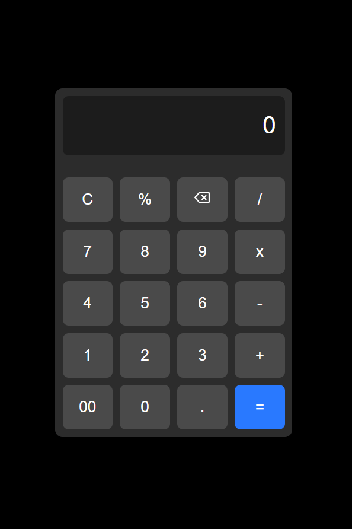

# React Calculator App

A modern, intuitive calculator application built with React. This project demonstrates clean code architecture and responsive design principles while providing essential arithmetic functionality.



## ✨ Features

- Basic arithmetic operations (addition, subtraction, multiplication, division)
- Clean, modern user interface
- Fully responsive design for all devices
- Real-time calculation updates
- Keyboard support for number input

## 🚀 Live Demo

Check out the live demo of the calculator in action:


## 🛠️ Prerequisites

Before you begin, ensure you have the following installed:
- Node.js (v16.0.0 or later)
- npm (Node Package Manager)

## 🏃‍♂️ Getting Started

Follow these steps to get the calculator up and running on your local machine:

1. **Clone the repository**
   ```bash
   git clone https://github.com/abilmathewjohn/react-calculator-app.git
   ```

2. **Navigate to project directory**
   ```bash
   cd react-calculator-app
   ```

3. **Install dependencies**
   ```bash
   npm install
   ```

4. **Start the development server**
   ```bash
   npm start
   ```

The application will automatically open in your default browser at `http://localhost:3000`.

## 📁 Project Structure

```
react-calculator-app/
├── public/
│   ├── index.html
│   ├── screenshot.png    # Add your screenshot here
│   └── demo.gif         # Add your demo GIF here
├── src/
│   ├── App.js
│   └── index.js
├── README.md
└── package.json
```

## 💻 Development

The application is built using:
- React for the user interface
- CSS for styling
- JavaScript for calculator logic

To make changes:
1. Edit the main application logic in `App.js`
2. Modify styles in the CSS files
3. Test your changes using `npm test`
4. Build for production with `npm run build`

## 📞 Contact

Abil Mathew John - [GitHub](https://github.com/abilmathewjohn)

Project Link: [https://github.com/abilmathewjohn/react-calculator-app](https://github.com/abilmathewjohn/react-calculator-app)